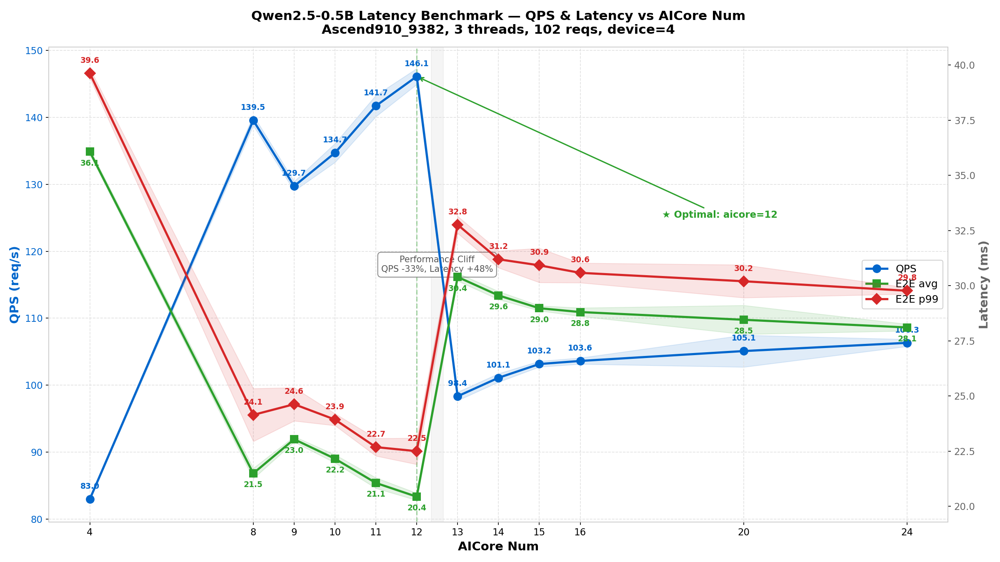

# Qwen2.5-0.5B AICore 限核性能测试报告

> 测试日期: 2026-08-10
> 测试环境: Ascend910_9382, NPU device 4
> 模型: qwen2.5-0.5b (varlen, 2D TND, frozen_parameter, fp16, 1090.9 MB OM)
> 测试工具: `atb/build/bench_latency`
> 日志文件: `aicore.log` (aicore=4,8,12,16,20,24), `aicore9_15.log` (aicore=9,10,11,12,13,14,15)

## 1. 测试背景

### 1.1 目的

Ascend910_9382 共有 48 个 AI Core。通过 ATC 编译参数 `--aicore_num="N|2N"` 限制模型可用的 AI Core 数量, 寻找 Qwen2.5-0.5B 在该芯片上的最优核数配置。

### 1.2 ATC 编译参数

```bash
atc --framework=1 \
    --model=qwen2.5-0.5b.air \
    --output=qwen2.5-0.5b \
    --soc_version=Ascend910_9382 \
    --aicore_num="N|2N"
```

`--aicore_num` 格式为 `"物理核数|逻辑核数"`, 例如 `"12|24"` 表示使用 12 个物理 AI Core。

### 1.3 编译结果

所有核数配置下 ATC 编译均成功, matmul 算子匹配数一致:

```
the matmul_match num is  169
the matmul_effect num is  169
```

编译产出的 OM 大小均为 1090.9 MB, 不同核数仅影响算子 tiling 策略和调度, 不改变模型权重。

## 2. 测试配置

```
模型:              qwen2.5-0.5b_linux_aarch64.om
batch_size:        固定 10
seq_len:           lognormal(4.997, 0.167), clipped [1, 218]  → avg≈150, p99≈218
cos/sin:           预计算 [218, 64] 表, 按 position_ids gather
warmup:            20 requests
total_requests:    100 (每线程 34, 共 3 线程, 实际 102)
device_id:         4
threads:           3 (每线程独立模型实例)
aicore sweep:      4, 8, 9, 10, 11, 12, 13, 14, 15, 16, 20, 24
每核数重复轮数:    10
```

> aicore=12 在两次测试中各跑 10 轮, 共 20 轮样本。

## 3. 测试结果

### 3.1 汇总数据 (剔除异常值后)

> 异常值剔除采用 IQR 方法 (Q1 - 1.5×IQR, Q3 + 1.5×IQR)。

| AICore | 样本数 | QPS | Token/s | E2E avg (ms) | E2E p99 (ms) | Exec avg (ms) |
|--------|--------|-----|---------|--------------|--------------|---------------|
| 4 | 9 | 83.0 | 124,220 | 36.07 | 39.63 | 35.49 |
| 8 | 8 | 139.5 | 208,869 | 21.49 | 24.14 | 20.98 |
| 9 | 10 | 129.7 | 194,176 | 23.04 | 24.63 | 22.53 |
| 10 | 9 | 134.7 | 201,620 | 22.15 | 23.93 | 21.65 |
| 11 | 9 | 141.7 | 212,105 | 21.06 | 22.68 | 20.55 |
| **12** | **19** | **146.1** | **218,690** | **20.43** | **22.50** | **19.91** |
| 13 | 10 | 98.4 | 147,220 | 30.39 | 32.76 | 29.83 |
| 14 | 10 | 101.1 | 151,344 | 29.56 | 31.20 | 29.00 |
| 15 | 10 | 103.2 | 154,418 | 28.98 | 30.92 | 28.43 |
| 16 | 9 | 103.6 | 155,106 | 28.80 | 30.58 | 28.29 |
| 20 | 10 | 105.1 | 157,316 | 28.45 | 30.20 | 27.91 |
| 24 | 10 | 106.3 | 159,157 | 28.11 | 29.77 | 27.53 |

### 3.2 性能趋势图



### 3.3 性能曲线示意

```
QPS
 146 │                          ★ 12 (最优)
 142 │                    ★ 11
 135 │              ★ 10
 130 │         ★ 9
 106 │                                        ★ 24
 103 │                              ★ 15  ★ 16  ★ 20
 101 │                    ★ 13   ★ 14
  83 │  ★ 4
     └────┬────┬────┬────┬────┬────┬────┬────┬────→ aicore
          4    8    9   10   11   12   13   15   24

E2E avg (ms)
 36.0 │  ★ 4
 30.0 │                    ★ 13
 28.5 │                              ★ 15  ★ 16  ★ 20  ★ 24
 23.0 │         ★ 9
 22.0 │              ★ 10        ★ 11
 21.0 │                    ★ 12  ★ 8
 20.0 │                          ★ 12
     └────┬────┬────┬────┬────┬────┬────┬────┬────→ aicore
          4    8    9   10   11   12   13   15   24
```

## 4. 分析

### 4.1 最优点: aicore=12

aicore=12 在所有指标上均为最优, 且两次测试共 20 轮数据高度一致:

| 指标 | aicore=12 | aicore=24 (满配一半) | 提升 |
|------|-----------|----------------------|------|
| QPS | 146.1 | 106.3 | +37.5% |
| E2E avg | 20.43ms | 28.11ms | -27.3% |
| E2E p99 | 22.50ms | 29.77ms | -24.4% |
| Token吞吐 | 218,690 | 159,157 | +37.4% |

用满配一半的核, 获得近 40% 的性能提升。

### 4.2 性能断崖: 12→13

12→13 之间存在一步性能断崖, 非渐进退化:

| 跳变 | QPS 变化 | E2E 变化 |
|------|---------|---------|
| 11→12 | +3.1% (141.7→146.1) | -3.1% (21.06→20.43) |
| **12→13** | **-32.6% (146.1→98.4)** | **+48.7% (20.43→30.39)** |
| 13→14 | +2.8% (98.4→101.1) | -2.7% (30.39→29.56) |
| 14→15 | +2.0% (101.1→103.2) | -2.0% (29.56→28.98) |

12→13 的 QPS 砍掉三分之一, 延迟增加近一半。13 之后缓慢恢复, 但到 24 核仍远低于 12 核水平。

### 4.3 12 之前的边际收益递减

| 步进 | QPS 增量 | 边际收益 |
|------|---------|---------|
| 4→8 | +56.5 (83→139.5) | 显著 |
| 8→9 | -9.8 (139.5→129.7) | 回退 * |
| 9→10 | +5.0 (129.7→134.7) | 良好 |
| 10→11 | +7.0 (134.7→141.7) | 良好 |
| 11→12 | +4.4 (141.7→146.1) | 趋缓, 接近饱和 |

> *aicore=8 的 QPS 高于 9, 可能因 8 核时 tiling 策略恰好更适配模型结构, 或 9 核引入了不均衡的调度开销。但 aicore=8 的 E2E (21.49ms) 仍高于 12 (20.43ms), 综合来看 12 更优。

### 4.4 断崖原因推测

0.5B 是小模型, 12 核已饱和算力。超过 12 核反而退化, 可能原因:

1. **调度域边界**: 910_9382 的 AI Core 可能划分为多个 cluster/die, 12 核恰好处于一个调度域内, 超过即引入跨域同步开销
2. **内存带宽争用**: 更多核竞争 HBM 带宽, matmul 受限于带宽而非算力
3. **同步开销**: 核间 barrier/同步成本随核数增长, 超过并行收益

### 4.5 Execute 占 E2E 的 97%+

所有核数配置下, Execute 占 E2E 的 97%+, Data Gen / H2D / D2H 合计 <1ms:

| 阶段 | 典型耗时 (aicore=12) | 占 E2E 比例 |
|------|---------------------|------------|
| Data Gen | 0.28ms | 1.4% |
| H2D | 0.13ms | 0.6% |
| **Execute** | **19.91ms** | **97.5%** |
| D2H | 0.15ms | 0.7% |
| E2E | 20.43ms | 100% |

说明 `aicore_num` 参数纯粹影响 NPU 计算效率, 非 NPU 开销可忽略。

### 4.6 异常事件

| aicore | 轮次 | 现象 | 原因分析 |
|--------|------|------|---------|
| 8 | 第9轮 | QPS=106 (正常~140), E2E=28ms | 疑似调度抖动或瞬时热降频, 单次事件 |
| 10 | 第10轮 | QPS=119.68 (正常~135), E2E=24.95ms | 轻度降速, 可能热效应 |
| 11 | 第3轮 | QPS=29.45 (正常~142), p99=1679ms, max=2674ms | 严重 hang 事件, Thread 1 avg=101.8ms, Thread 2 avg=67ms, Thread 0 正常(15.5ms), 疑似 driver/硬件 hang |
| 20 | 奇偶轮交替 | 奇数轮~107 QPS/27.8ms, 偶数轮~103 QPS/29ms | 规律性双峰, 疑似 DVFS 在两个频率档间振荡 |

### 4.7 稳定性

剔除异常值后各核数的 QPS 标准差:

| aicore | QPS std | 稳定性评价 |
|--------|---------|-----------|
| 4 | 0.26 | 极稳定 |
| 8 | 1.40 | 稳定 |
| 9 | 0.71 | 极稳定 |
| 10 | 1.40 | 稳定 |
| 11 | 1.59 | 稳定 |
| **12** | **1.94** | **稳定 (20轮样本)** |
| 13 | 0.63 | 极稳定 |
| 14 | 0.63 | 极稳定 |
| 15 | 0.43 | 极稳定 |
| 16 | 1.12 | 稳定 |
| 20 | 2.38 | 双峰波动 |
| 24 | 0.53 | 极稳定 |

## 5. 结论与建议

### 5.1 推荐配置

**aicore=12 (`--aicore_num="12|24"`)** 是 Qwen2.5-0.5B 在 Ascend910_9382 上的最优编译参数。

理由:
1. **QPS 最高**: 146.1, 比满配一半 (24核) 高 37.5%
2. **延迟最低**: E2E avg 20.43ms, 比 24 核低 27.3%
3. **稳定性好**: 20 轮测试 QPS std 仅 1.94, 无异常事件
4. **边际收益已饱和**: 11→12 仅 +3.1%, 12 之后性能断崖式下降

### 5.2 不同场景建议

| 场景 | 推荐 aicore | 理由 |
|------|------------|------|
| **最优延迟与吞吐** | 12 | QPS 146, E2E 20ms |
| **多实例共享芯片** | 12 × 2 实例 | 48 核可跑 2 个 12 核实例, 总吞吐翻倍 |
| **多实例共享芯片** | 8 × 3 实例 | 48 核可跑 3 个 8 核实例, 单实例 QPS 140, 总吞吐 ~420 |
| **资源受限** | 4 | QPS 83, E2E 36ms, 最少资源 |

### 5.3 一句话总结

aicore=12 是 Qwen2.5-0.5B 在 Ascend910_9382 上的性能最优点, 超过 12 核出现一步断崖式退化 (QPS -33%, 延迟 +48%), 推测与芯片的调度域/cluster 划分有关。

## 6. 测试命令

### 6.1 编译不同核数的 OM

```bash
# 以 aicore=12 为例
./run.sh atc --aicore-num 12
# 等价于: atc --framework=1 --model=qwen2.5-0.5b.air --output=qwen2.5-0.5b \
#   --soc_version=Ascend910_9382 --aicore_num="12|24"
```

### 6.2 延迟基准测试

```bash
atb/build/bench_latency \
    --model atb/models/qwen2.5-0.5b/om/qwen2.5-0.5b_linux_aarch64.om \
    --threads 3 --requests 100 --warmup 20 --device-id 4
```

### 6.3 多核数批量测试

```bash
for n in 4 8 9 10 11 12 13 14 15 16 20 24; do
    ./run.sh atc --aicore-num $n
    for round in $(seq 1 10); do
        atb/build/bench_latency \
            --model atb/models/qwen2.5-0.5b/om/qwen2.5-0.5b_linux_aarch64.om \
            --threads 3 --requests 100 --warmup 20 --device-id 4
    done
done
```

## 7. 附录 A: 各核数逐轮数据

### 7.1 aicore=4

```
r1:  QPS= 83.01  E2E=36.05    r6:  QPS= 83.13  E2E=35.97
r2:  QPS= 82.94  E2E=35.98    r7:  QPS= 82.89  E2E=36.05
r3:  QPS= 82.89  E2E=36.07    r8:  QPS= 83.27  E2E=35.97
r4:  QPS= 83.17  E2E=36.00    r9:  QPS= 82.35  E2E=36.35  *
r5:  QPS= 82.84  E2E=36.14    r10: QPS= 82.78  E2E=36.15
```

### 7.2 aicore=8

```
r1:  QPS=139.65  E2E=21.38    r6:  QPS=129.39  E2E=22.06
r2:  QPS=138.11  E2E=21.62    r7:  QPS=139.89  E2E=21.35
r3:  QPS=139.63  E2E=21.39    r8:  QPS=140.16  E2E=21.35
r4:  QPS=138.64  E2E=21.58    r9:  QPS=106.15  E2E=28.17  * (异常)
r5:  QPS=140.21  E2E=21.33    r10: QPS=140.08  E2E=21.36
```

### 7.3 aicore=9

```
r1:  QPS=130.03  E2E=22.95    r6:  QPS=128.88  E2E=23.18
r2:  QPS=129.14  E2E=23.13    r7:  QPS=130.24  E2E=22.94
r3:  QPS=130.30  E2E=22.95    r8:  QPS=129.14  E2E=23.15
r4:  QPS=128.85  E2E=23.21    r9:  QPS=130.67  E2E=22.87
r5:  QPS=130.57  E2E=22.92    r10: QPS=129.46  E2E=23.10
```

### 7.4 aicore=10

```
r1:  QPS=136.70  E2E=21.85    r6:  QPS=134.42  E2E=22.18
r2:  QPS=134.31  E2E=22.27    r7:  QPS=134.99  E2E=22.10
r3:  QPS=135.53  E2E=22.09    r8:  QPS=131.81  E2E=22.45
r4:  QPS=134.27  E2E=22.25    r9:  QPS=134.18  E2E=22.26
r5:  QPS=136.10  E2E=21.94    r10: QPS=119.68  E2E=24.95  * (异常)
```

### 7.5 aicore=11

```
r1:  QPS=139.85  E2E=21.27    r6:  QPS=143.47  E2E=20.82
r2:  QPS=143.78  E2E=20.75    r7:  QPS=140.32  E2E=21.34
r3:  QPS= 29.45  E2E=61.46  * (严重异常, hang)   r8:  QPS=143.36  E2E=20.82
r4:  QPS=142.09  E2E=20.95    r9:  QPS=140.23  E2E=21.28
r5:  QPS=140.21  E2E=21.28    r10: QPS=142.05  E2E=21.02
```

### 7.6 aicore=12 (两次测试共 20 轮)

```
--- 第一次 (aicore.log) ---
r1:  QPS=144.91  E2E=20.55    r6:  QPS=147.32  E2E=20.26
r2:  QPS=146.65  E2E=20.37    r7:  QPS=146.47  E2E=20.42
r3:  QPS=146.31  E2E=20.38    r8:  QPS=147.53  E2E=20.29
r4:  QPS=147.78  E2E=20.23    r9:  QPS=143.93  E2E=20.59
r5:  QPS=146.82  E2E=20.38    r10: QPS=145.54  E2E=20.41
--- 第二次 (aicore9_15.log) ---
r11: QPS=144.71  E2E=20.63    r16: QPS=144.12  E2E=20.70
r12: QPS=147.28  E2E=20.27    r17: QPS=140.86  E2E=20.76
r13: QPS=146.61  E2E=20.33    r18: QPS=146.33  E2E=20.38
r14: QPS=147.29  E2E=20.18    r19: QPS=146.06  E2E=20.48
r15: QPS=144.46  E2E=20.62    r20: QPS=145.89  E2E=20.46
```

### 7.7 aicore=13

```
r1:  QPS= 97.97  E2E=30.51    r6:  QPS= 98.82  E2E=30.28
r2:  QPS= 97.57  E2E=30.56    r7:  QPS= 98.72  E2E=30.30
r3:  QPS= 98.99  E2E=30.21    r8:  QPS= 98.70  E2E=30.29
r4:  QPS= 98.64  E2E=30.32    r9:  QPS= 97.74  E2E=30.58
r5:  QPS= 99.05  E2E=30.19    r10: QPS= 97.35  E2E=30.70
```

### 7.8 aicore=14

```
r1:  QPS=101.55  E2E=29.40    r6:  QPS=101.26  E2E=29.48
r2:  QPS=100.71  E2E=29.71    r7:  QPS=100.44  E2E=29.75
r3:  QPS=101.77  E2E=29.41    r8:  QPS=101.22  E2E=29.56
r4:  QPS=100.98  E2E=29.61    r9:  QPS=101.23  E2E=29.50
r5:  QPS=102.04  E2E=29.27    r10: QPS= 99.91  E2E=29.88
```

### 7.9 aicore=15

```
r1:  QPS=103.67  E2E=28.86    r6:  QPS=102.90  E2E=29.03
r2:  QPS=103.40  E2E=28.91    r7:  QPS=103.16  E2E=28.98
r3:  QPS=104.03  E2E=28.74    r8:  QPS=103.16  E2E=28.97
r4:  QPS=102.69  E2E=29.06    r9:  QPS=102.74  E2E=29.13
r5:  QPS=103.07  E2E=29.04    r10: QPS=102.84  E2E=29.05
```

### 7.10 aicore=16

```
r1:  QPS=103.09  E2E=29.03    r6:  QPS=104.04  E2E=28.74
r2:  QPS=100.37  E2E=28.40  * r7:  QPS=103.79  E2E=28.78
r3:  QPS=103.02  E2E=28.99    r8:  QPS=103.88  E2E=28.76
r4:  QPS=103.09  E2E=29.02    r9:  QPS=103.81  E2E=28.80
r5:  QPS=103.62  E2E=28.85    r10: QPS=104.30  E2E=28.66
```

### 7.11 aicore=20

```
r1:  QPS=107.53  E2E=27.80    r6:  QPS=103.13  E2E=28.98
r2:  QPS=102.80  E2E=29.08    r7:  QPS=107.30  E2E=27.86
r3:  QPS=107.55  E2E=27.77    r8:  QPS=103.20  E2E=28.97
r4:  QPS=102.95  E2E=29.02    r9:  QPS=107.32  E2E=27.84
r5:  QPS=107.03  E2E=27.92    r10: QPS=102.22  E2E=29.29
```

> 奇数轮 ~107 QPS, 偶数轮 ~103 QPS, 呈规律性双峰交替。

### 7.12 aicore=24

```
r1:  QPS=106.09  E2E=28.19    r6:  QPS=105.36  E2E=28.39
r2:  QPS=106.66  E2E=27.98    r7:  QPS=105.84  E2E=28.24
r3:  QPS=106.08  E2E=28.22    r8:  QPS=106.92  E2E=27.96
r4:  QPS=106.94  E2E=27.93    r9:  QPS=106.11  E2E=28.11
r5:  QPS=106.44  E2E=28.07    r10: QPS=106.88  E2E=27.96
```
