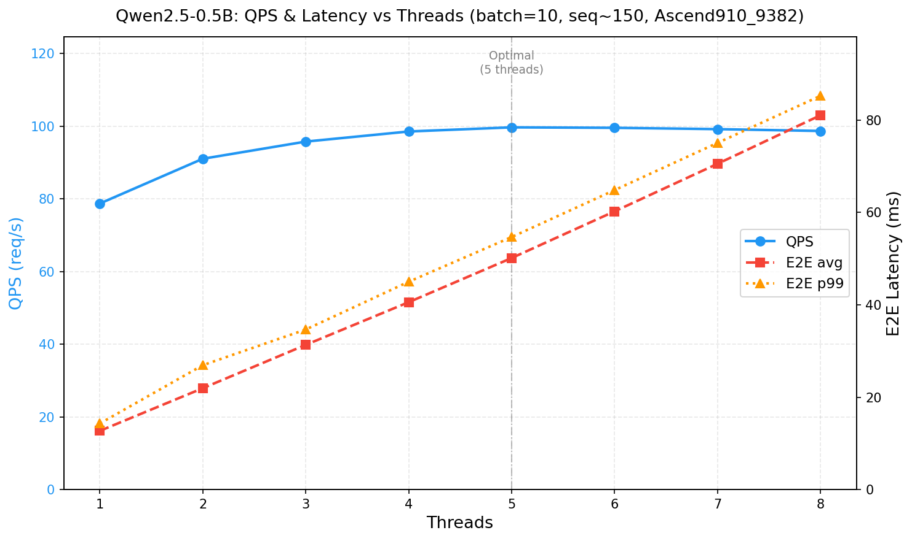

# Qwen2.5-0.5B Ascend NPU 部署指南

## 1. 概述

本项目将 Qwen2.5-0.5B 大语言模型部署到华为 Ascend NPU，采用 varlen packed（变长拼接）技术实现高效批处理推理。全流程为：

```
PyTorch (NPU融合算子) → AIR (torchair导出) → OM (ATC编译) → ACL推理
```

**核心特性：**
- 2D TND 格式（hidden_states 全程 `[T, D]`，消除 Pack 算子）
- 4 个图输入（权重通过 `frozen_parameter` 冻结为图常量）
- NPU 融合算子（RMSNorm + RoPE + FusedInferAttentionScore）
- RoPE cos/sin 图外预计算（消除图内 5 个 kernel）
- 动态 shape（T 维度可变，支持不同 batch/seq 组合）

## 2. 环境要求

### 2.1 推荐环境

使用以下 Docker 镜像（已预装全部依赖）：

```
quay.io/jd_xllm/xllm-ai:xllm-dev-a3-arm-cann9-20260605
```

### 2.2 软件版本

| 项目 | 版本 |
|------|------|
| SoC | Ascend910_9382 |
| CANN Toolkit | 9.0.0 |
| Python | 3.11 |
| PyTorch | 2.9.0 |
| torch_npu | 2.9.0.post2 |
| transformers | 5.10.1 |

### 2.3 环境初始化

每次使用前执行：

```bash
source /usr/local/Ascend/ascend-toolkit/latest/set_env.sh
npu-smi info
```

## 3. 生成 AIR 模型

### 3.1 一键导出（推荐）

```bash
python -m qwen_varlen.export_air \
    --device 0 \
    --dynamic \
    --run-atc \
    --soc Ascend910_9382
```

**参数说明：**

| 参数 | 默认值 | 说明 |
|------|--------|------|
| `--device` | 8 | NPU 设备号 |
| `--dynamic` | False | 导出动态 shape（推荐） |
| `--run-atc` | False | 导出后自动执行 ATC 编译为 OM |
| `--soc` | Ascend910_9382 | 目标 SoC 型号 |
| `--model-path` | /export/home/models/Qwen2.5-0.5B | HuggingFace 模型路径 |
| `--batch-size` | 10 | 导出时的 batch size（仅影响 trace） |
| `--seq-len` | 208 | 导出时的序列长度（仅影响 trace） |

**输出文件：**
- AIR: `atb/models/qwen2.5-0.5b/air/qwen2.5-0.5b.air`
- OM: `atb/models/qwen2.5-0.5b/om/qwen2.5-0.5b_linux_aarch64.om`

### 3.2 导出流程说明

`export_air` 内部执行以下步骤：

1. 加载 Qwen2.5-0.5B 模型到 NPU（fp16，`npu_fia` 注意力实现）
2. 应用 NPU 融合算子：
   - `Qwen2RMSNorm` → `npu_rms_norm`
   - `apply_rotary_pos_emb` → `npu_apply_rotary_pos_emb`
   - RoPE cos/sin 改为图外预计算
3. Patch 注意力前向函数（2D 模式，reshape 用 -1 避免 Pack 算子）
4. 通过 `torchair.dynamo_export` 导出 AIR（`frozen_parameter=1` 冻结权重）
5. 验证导出的算子数量（可选，默认开启）

## 4. ATC 转换为 OM

### 4.1 自动转换（通过 --run-atc）

使用 `--run-atc` 参数时，`export_air.py` 会自动执行 ATC 编译，无需手动操作。

### 4.2 手动转换

如果已有 AIR 文件，可单独执行 ATC：

```bash
atc \
    --framework=1 \
    --model=atb/models/qwen2.5-0.5b/air/qwen2.5-0.5b.air \
    --output=atb/models/qwen2.5-0.5b/om/qwen2.5-0.5b \
    --soc_version=Ascend910_9382
```

**参数说明：**

| 参数 | 值 | 说明 |
|------|-----|------|
| `--framework` | 1 | 输入为 AIR 格式（GE 原生图格式） |
| `--model` | AIR 文件路径 | 输入模型 |
| `--output` | 输出路径（不带后缀） | ATC 自动添加 `.om` 后缀 |
| `--soc_version` | Ascend910_9382 | 目标 SoC 型号 |

> **注意：** ATC 默认使用 `force_fp16` 精度模式，无需显式指定 `--precision_mode`。动态 shape 信息已编码在 AIR 图中（由 dynamo_export 的 `mark_dynamic` 标记），无需 `--input_shape` 参数。

### 4.3 ATC 输出说明

- 动态模型 OM 文件名会追加系统后缀：`qwen2.5-0.5b_linux_aarch64.om`
- 文件大小约 1.3GB（包含全部冻结权重）
- OM 文件与 SoC 和架构绑定，不可跨平台使用


## 5. 运行推理

OM 模型可通过 ACL（Ascend Computing Language）直接调用。本项目提供了基于 ACL 的推理二进制和示例源码，也可参考后自行集成。

### 5.1 输入说明

模型有 4 个输入，**cos/sin 必须由调用方图外预计算后传入**（图中不包含 RoPE 位置编码计算逻辑）：

| 序号 | 名称 | Shape | Dtype | 说明 |
|------|------|-------|-------|------|
| 0 | actual_seq_lengths | [N] | int64 | 累积序列长度，用于 varlen 拼接切分 |
| 1 | cos | [1, T, 64] | float16 | RoPE cos 表，按 position_ids 预计算 gather |
| 2 | sin | [1, T, 64] | float16 | RoPE sin 表，按 position_ids 预计算 gather |
| 3 | input_ids | [T] | int64 | 所有序列拼接后的 token ids |

**cos/sin 预计算要点：**
- 预计算 `[1, MAX_SEQ_LEN, 64]` 的完整 cos/sin 表（MAX_SEQ_LEN=2048）
- varlen 模式下每条序列的 position 从 0 重启：`pos = [0..L₁-1, 0..L₂-1, ...]`
- 按 position_ids gather 得到 `[1, T, 64]`，T 为所有序列 token 总数
- 预计算逻辑参见 `qwen_varlen/varlen_utils.py` 的 `precompute_rope_cos_sin`

使用以下命令生成测试数据（全 0 token，用于功能验证）：

```bash
cd qwen2.5
python -m qwen_varlen.prepare_air_inputs --device 0
```

### 5.2 执行推理

```bash
cd atb

./build/acl_infer \
    --model models/qwen2.5-0.5b/om/qwen2.5-0.5b_linux_aarch64.om \
    --output_dir models/qwen2.5-0.5b/output \
    --device_id 0 \
    --input "arg1_1:10:int64:ND:models/qwen2.5-0.5b/input_data/actual_seq_lengths.bin" \
    --input "arg3_1:1,2080,64:float16:ND:models/qwen2.5-0.5b/input_data/cos.bin" \
    --input "arg5_1:1,2080,64:float16:ND:models/qwen2.5-0.5b/input_data/sin.bin" \
    --input "arg8_1:2080:int64:ND:models/qwen2.5-0.5b/input_data/input_ids.bin"
```

输入参数格式：`name:shape:dtype:format:filepath`（冒号分隔，shape 用逗号分隔）。输出为 `output_0.bin`（shape `[10, 151936]`, float16）。

> 推理二进制和 ACL 调用细节请参考源码：`atb/main.cpp`（acl_infer）、`atb/bench_latency.cpp`（延迟测试）、`atb/bench_throughput.cpp`（吞吐测试）。

## 6. 性能数据

测试条件：batch_size=10，seq_len 对数正态分布（均值 150，p99=218），8000 次请求，50 次预热，Ascend910_9382，CANN 9.0.0。

### 6.1 吞吐与延迟总览



| 线程数 | QPS (req/s) | Token 吞吐 (tokens/s) | E2E 延迟 avg (ms) | E2E 延迟 p99 (ms) |
|--------|-------------|----------------------|-------------------|-------------------|
| 1 | 78.70 | 117,995 | 12.70 | 14.30 |
| 2 | 91.02 | 136,414 | 21.94 | 26.92 |
| 3 | 95.75 | 143,508 | 31.32 | 34.65 |
| 4 | 98.53 | 147,623 | 40.57 | 44.99 |
| 5 | 99.67 | 149,325 | 50.13 | 54.67 |
| 6 | 99.54 | 149,237 | 60.24 | 64.84 |
| 7 | 99.18 | 148,685 | 70.54 | 75.07 |
| 8 | 98.67 | 147,921 | 81.05 | 85.25 |


### 6.2 分阶段延迟分解（3 线程配置）

| 阶段 | avg (ms) | p50 (ms) | p90 (ms) | p99 (ms) | max (ms) |
|------|----------|----------|----------|----------|----------|
| E2E（全链路） | 31.32 | 30.89 | 33.50 | 34.65 | 66.11 |
| Data Gen（数据生成） | 0.27 | 0.27 | 0.29 | 0.34 | 2.14 |
| H2D（主机到设备） | 0.10 | 0.10 | 0.12 | 0.16 | 0.70 |
| Execute（NPU 执行） | 30.82 | 30.40 | 32.99 | 34.11 | 65.58 |
| D2H（设备到主机） | 0.13 | 0.12 | 0.15 | 0.18 | 0.65 |


## 7. 模型 I/O 规格

### 7.1 输入（4 个）

| 序号 | 图节点名 | 语义 | Shape | Dtype | Format | 动态维度 |
|------|----------|------|-------|-------|--------|---------|
| 0 | arg1_1 | actual_seq_lengths | [N] | int64 | ND | dim 0 (N) |
| 1 | arg3_1 | cos (RoPE) | [1, T, 64] | float16 | ND | dim 1 (T) |
| 2 | arg5_1 | sin (RoPE) | [1, T, 64] | float16 | ND | dim 1 (T) |
| 3 | arg8_1 | input_ids | [T] | int64 | ND | dim 0 (T) |

### 7.2 输出（1 个）

| 序号 | 语义 | Shape | Dtype | Format |
|------|------|-------|-------|--------|
| 0 | logits（每条序列最后一个 token） | [N, 151936] | float16 | ND |


