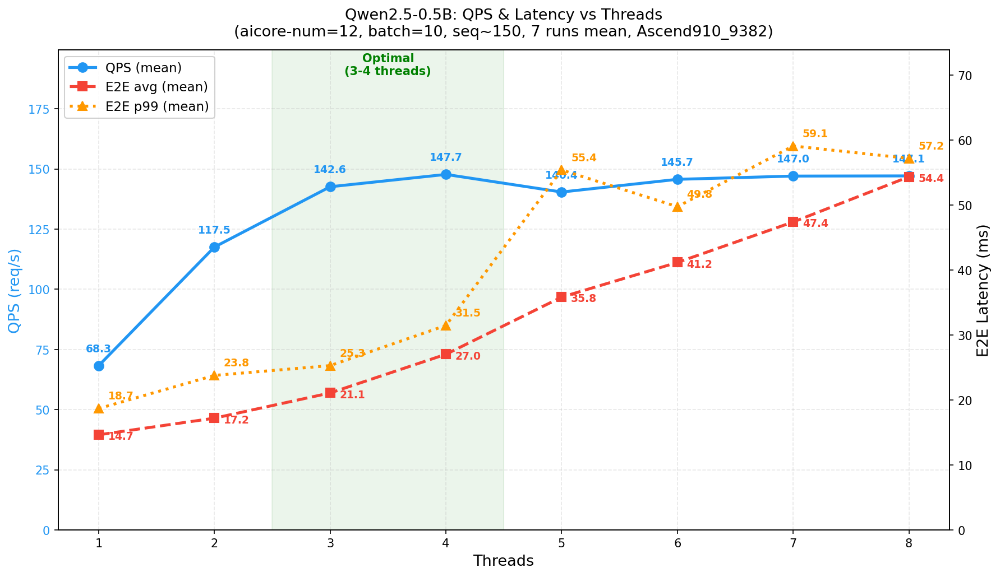
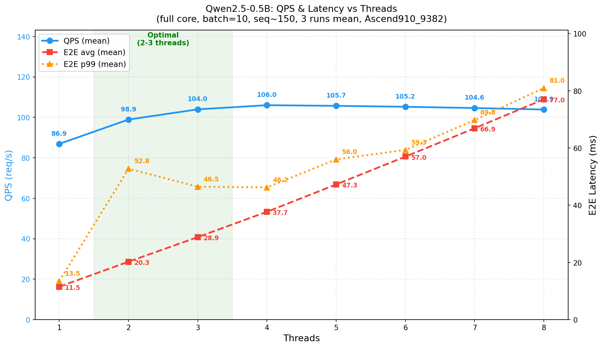

# Qwen2.5-0.5B Ascend NPU 部署指南 (v2.0)

## 1. 概述

本项目将 Qwen2.5-0.5B 大语言模型部署到华为 Ascend NPU，采用 varlen packed（变长拼接）技术实现高效批处理推理。全流程为：

```
PyTorch (NPU融合算子) → AIR (torchair导出) → OM (ATC编译) → ACL推理
```

**核心特性：**
- 2D TND 格式（hidden_states 全程 `[T, D]`，消除 Pack 算子）
- 4 个图输入（权重通过 `frozen_parameter` 冻结为图常量）
- NPU 融合算子（RMSNorm + RoPE + FusedInferAttentionScore）
- RoPE cos/sin 图外预计算（消除图内 5 个 kernel）
- 动态 shape（T 维度可变，支持不同 batch/seq 组合）

**v2.0 新增特性（相比 v1.0）：**
- NZ 权重格式（自定义 GE pass 将 MatMul 权重转为 FRACTAL_NZ + MatMulV3，提升 Cube 内存效率）
- FFN 拆分（去除 npu_ffn 融合，拆为独立 Gate/Up/Down MatMul，MAC 利用率从 43.5% 提升至 75-79%）
- 词表剪裁（`--prune-lm-head`，可选裁剪 lm_head 输出维度）
- AICore 限核（`--aicore-num`，控制 ATC 编译时使用的 AI Core 数量）

## 2. 环境要求

### 2.1 推荐环境

使用以下 Docker 镜像（已预装全部依赖）：

```
quay.io/jd_xllm/xllm-ai:xllm-dev-a3-arm-cann9-20260605
```

### 2.2 软件版本

| 项目 | 版本 |
|------|------|
| SoC | Ascend910_9382 |
| CANN Toolkit | 9.0.0 |
| Python | 3.11 |
| PyTorch | 2.9.0 |
| torch_npu | 2.9.0.post2 |
| transformers | 5.10.1 |

### 2.3 环境初始化

每次使用前执行：

```bash
source /usr/local/Ascend/ascend-toolkit/latest/set_env.sh
npu-smi info
```

## 3. 全流程一键部署

v2.0 提供 `run.sh` 一键脚本，通过子命令驱动完整部署流程。

### 3.1 全流程执行

```bash
bash run.sh
```

依次执行 `pass → export → atc → bench` 四个步骤，完成后即可得到可推理的 OM 模型。

### 3.2 各步骤说明

#### Step 1: `pass` — 编译 NZ Weight Pass

```bash
./run.sh pass
```

编译自定义 GE pass（`pass/nz_weight_pass.cpp`），产物 `libnz_weight_pass.so` 安装到 CANN vendor 目录。该 pass 在 ATC 编译阶段将 MatMul/MatMulV2 权重从 ND 格式转换为 FRACTAL_NZ 格式，并将算子节点替换为 MatMulV3，减少 L1 buffer 数据搬运，提升 Cube 内存效率。

> 需要 root 权限，只需执行一次。

#### Step 2: `export` — 导出 AIR

```bash
./run.sh export
```

调用 `model.export_air`，完成以下工作：
1. 加载 Qwen2.5-0.5B 模型到 NPU（fp16，`npu_fia` 注意力实现）
2. 应用 NPU 融合算子（RMSNorm、RoPE、cos/sin 图外预计算）
3. Patch 注意力前向函数（2D 模式，避免 Pack 算子）
4. 通过 `torchair.dynamo_export` 导出 AIR（`frozen_parameter=1` 冻结权重）

输出：`air/qwen2.5-0.5b.air`

可选加 `--prune` 开启 lm_head 词表剪裁，将输出维度从 151936 裁剪为指定 token 数，减少 D2H 传输量。剪裁目标由 `atb/models/qwen2.5-0.5b/target_tokens.json` 配置。

#### Step 3: `atc` — ATC 编译（AIR → OM）

```bash
./run.sh atc
```

调用 ATC 编译器将 AIR 转换为 OM 模型。NZ weight pass 在此阶段自动生效。ATC 默认 `force_fp16` 精度模式，动态 shape 已编码在 AIR 图中。

输出：`om/qwen2.5-0.5b_linux_aarch64.om`（约 1.3GB，包含全部冻结权重）

可选加 `--aicore-num N` 限制 AI Core 数量（详见第 4 章）。

#### Step 4: `bench` — 延迟 Benchmark

```bash
./run.sh bench --threads 3
```

调用 `bench_latency` 进行延迟和吞吐测试。支持 `--threads` 指定并发线程数。

## 4. AICore 限核部署

### 4.1 概述

限核功能允许在 ATC 编译阶段限制模型使用的 AI Core 数量，适用于多模型共享同一张 NPU 卡的场景。通过 `--aicore-num` 参数控制分配给当前模型的 AIC（AI Cube）和 AIV（AI Vector）核心数，避免单个模型独占全部计算资源。

### 4.2 前置条件：安装 GE Compiler 和 GE Executor

限核功能依赖 CANN GE Compiler 和 GE Executor 组件。安装包位于 `11.87.191.99` 的 `/export/home/weinan5/hejun/tran/`，拷贝到本机后执行：

```bash
./cann-ge-compiler_linux-aarch64.run --full -q
./cann-ge-executor_linux-aarch64.run --full -q
```

安装完成后重新加载环境：

```bash
source /usr/local/Ascend/ascend-toolkit/latest/set_env.sh
```

### 4.3 使用 --aicore-num 导出 OM

安装 GE 组件后，通过 `--aicore-num` 参数重新编译 OM：

```bash
./run.sh atc --aicore-num 12
```

### 4.4 不同核数性能对比

以下为不同 AICore 核数配置下的 QPS 与延迟测试结果：



### 4.5 与 v2.0 延迟-QPS 曲线对比




## 5. 模型 I/O 规格

### 5.1 输入（4 个）

| 序号 | 图节点名 | 语义 | Shape | Dtype | Format | 动态维度 |
|------|----------|------|-------|-------|--------|---------|
| 0 | arg1_1 | actual_seq_lengths | [N] | int64 | ND | dim 0 (N) |
| 1 | arg3_1 | cos (RoPE) | [1, T, 64] | float16 | ND | dim 1 (T) |
| 2 | arg5_1 | sin (RoPE) | [1, T, 64] | float16 | ND | dim 1 (T) |
| 3 | arg8_1 | input_ids | [T] | int64 | ND | dim 0 (T) |

### 5.2 输出（1 个）

| 序号 | 语义 | Shape | Dtype | Format |
|------|------|-------|-------|--------|
| 0 | logits（每条序列最后一个 token） | [N, 151936] | float16 | ND |

> 启用词表剪裁后，输出 shape 变为 `[N, pruned_vocab_size]`（如 `[N, 8]`）。
